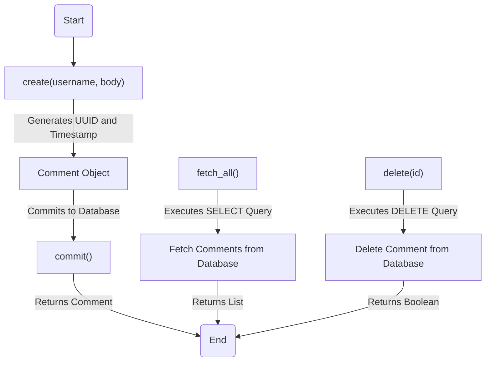
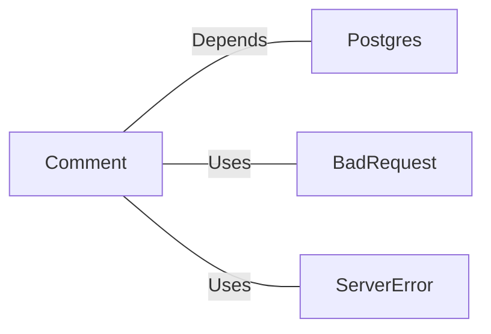

# Comment.java: Comment Management Class

## Overview
The `Comment` class is responsible for managing comments in an application. It provides functionality to create, fetch, and delete comments, as well as commit them to a database. The class interacts with a PostgreSQL database to store and retrieve comment data.

## Process Flow

## Insights
- **Comment Object**: Represents a single comment with attributes `id`, `username`, `body`, and `created_on`.
- **Database Interaction**: The class interacts with a PostgreSQL database using SQL queries for CRUD operations.
- **Error Handling**: Custom exceptions (`BadRequest`, `ServerError`) are used for error handling during comment creation.
- **UUID Generation**: Each comment is assigned a unique identifier using `UUID.randomUUID()`.
- **Timestamp**: The `created_on` field is automatically populated with the current timestamp during comment creation.
- **Potential Vulnerabilities**:
  - **SQL Injection**: The `fetch_all()` method uses raw SQL queries without parameterized statements, making it vulnerable to SQL injection attacks.
  - **Improper Exception Handling**: The `delete()` method always returns `false` in the `finally` block, even if the operation succeeds.
  - **Resource Management**: Database connections and statements are not properly closed in some methods, which can lead to resource leaks.

## Dependencies

- `Postgres`: Provides the database connection for executing SQL queries.
- `BadRequest`: Custom exception used when a comment cannot be saved.
- `ServerError`: Custom exception used for server-side errors.

## Data Manipulation (SQL)
### Table: `comments`
| Attribute    | Data Type   | Description                          |
|--------------|-------------|--------------------------------------|
| `id`         | `VARCHAR`   | Unique identifier for the comment.  |
| `username`   | `VARCHAR`   | Username of the comment author.     |
| `body`       | `TEXT`      | Content of the comment.             |
| `created_on` | `TIMESTAMP` | Timestamp when the comment was created. |

### SQL Operations
- **INSERT**: Adds a new comment to the `comments` table.
- **SELECT**: Retrieves all comments from the `comments` table.
- **DELETE**: Removes a comment from the `comments` table based on its `id`.

## Vulnerabilities
1. **SQL Injection**:
   - The `fetch_all()` method uses raw SQL queries (`stmt.executeQuery(query)`), which are vulnerable to SQL injection attacks. Use parameterized queries to mitigate this risk.

2. **Improper Exception Handling**:
   - The `delete()` method always returns `false` in the `finally` block, even if the operation succeeds. This can lead to incorrect behavior.

3. **Resource Leaks**:
   - Database connections and statements are not properly closed in the `fetch_all()` and `delete()` methods. This can lead to resource exhaustion over time.

4. **Error Propagation**:
   - The `create()` method catches exceptions and wraps them in a `ServerError`, potentially obscuring the original error details.
