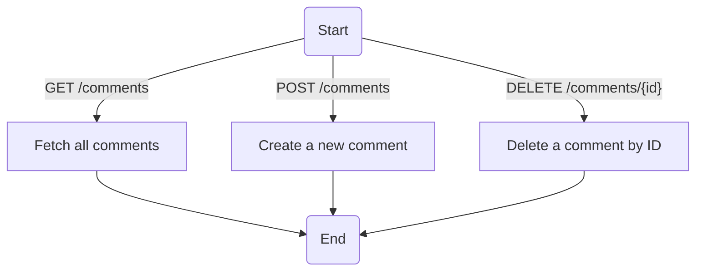
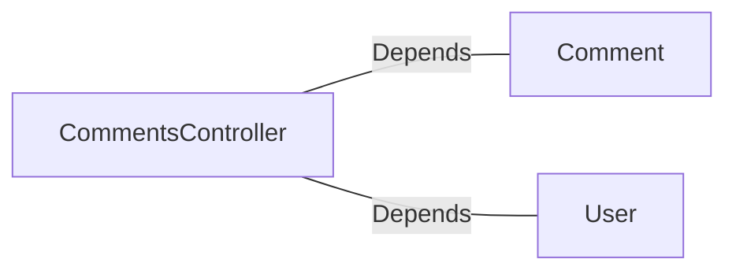

# CommentsController.java: REST API for Comment Management

## Overview
This file defines a REST API controller for managing comments. It provides endpoints to fetch all comments, create a new comment, and delete an existing comment. The controller uses Spring Boot annotations for configuration and routing, and includes basic authentication via a custom token mechanism.

## Process Flow

## Insights
- **Authentication**: The controller uses a custom authentication mechanism (`User.assertAuth`) to validate requests based on a secret and a token provided in the `x-auth-token` header.
- **Cross-Origin Resource Sharing (CORS)**: All endpoints allow requests from any origin (`@CrossOrigin(origins = "*")`), which may pose security risks if not properly managed.
- **Error Handling**: Custom exceptions (`BadRequest` and `ServerError`) are defined to handle specific error scenarios with appropriate HTTP status codes.
- **Serialization**: The `CommentRequest` class implements `Serializable` to facilitate JSON serialization/deserialization for incoming request bodies.
- **Endpoints**:
  - `GET /comments`: Fetches all comments.
  - `POST /comments`: Creates a new comment with a username and body.
  - `DELETE /comments/{id}`: Deletes a comment by its ID.

## Dependencies

- `Comment`: Used for fetching, creating, and deleting comments.
- `User`: Used for authentication via the `assertAuth` method.

## Vulnerabilities
1. **CORS Misconfiguration**:
   - Allowing requests from all origins (`@CrossOrigin(origins = "*")`) can expose the API to Cross-Site Request Forgery (CSRF) attacks or other malicious activities. It is recommended to restrict origins to trusted domains.

2. **Authentication Bypass**:
   - The `User.assertAuth` method is used for authentication, but its implementation is not provided. If this method does not properly validate the token, it could lead to unauthorized access.

3. **Hardcoded Secret**:
   - The `secret` value is injected from application properties (`@Value("${app.secret}")`). If this secret is not securely stored or rotated, it could be compromised, leading to security vulnerabilities.

4. **Error Handling**:
   - The custom exceptions (`BadRequest` and `ServerError`) do not provide detailed error messages or logging, which could make debugging and monitoring difficult.

5. **Lack of Input Validation**:
   - The `CommentRequest` class does not validate the `username` or `body` fields. This could lead to injection attacks (e.g., SQL injection or XSS) if the `Comment.create` method does not sanitize inputs.

6. **No Rate Limiting**:
   - The API does not implement rate limiting, making it vulnerable to abuse through excessive requests (e.g., DoS attacks).

## Data Manipulation (SQL)
- **Comment**:
  - Likely interacts with a database to perform operations such as fetching all comments, creating a new comment, and deleting a comment by ID. The exact SQL operations are not provided in the code.
