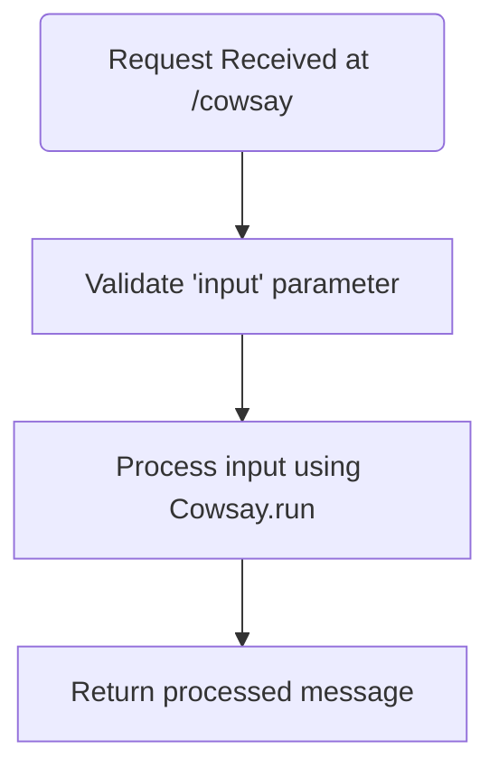
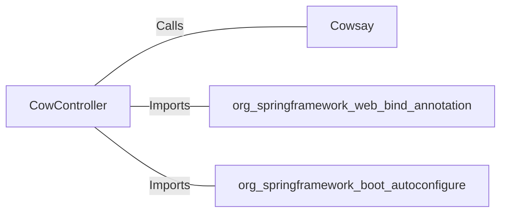

# CowController.java: REST Controller for CowSay Functionality

## Overview
The `CowController` class is a Spring Boot REST controller that provides an endpoint for generating "cowsay" messages. It accepts user input via a query parameter and processes it using the `Cowsay.run` method.

## Process Flow

## Insights
- The class is annotated with `@RestController` and `@EnableAutoConfiguration`, making it a Spring Boot REST controller with auto-configuration enabled.
- The `/cowsay` endpoint accepts a query parameter `input` with a default value of `"I love Linux!"`.
- The `Cowsay.run` method is used to process the input and generate the response.
- The code does not sanitize or validate the `input` parameter, which could lead to potential vulnerabilities if the `Cowsay.run` method executes arbitrary code or is susceptible to injection attacks.

## Vulnerabilities
1. **Potential Command Injection**:
   - The `input` parameter is directly passed to the `Cowsay.run` method without sanitization or validation.
   - If `Cowsay.run` executes system commands or interprets the input in an unsafe manner, this could lead to command injection vulnerabilities.

2. **Denial of Service (DoS)**:
   - If the `input` parameter is excessively large or contains malicious payloads, it could cause performance degradation or crash the application.

3. **Cross-Site Scripting (XSS)**:
   - If the `Cowsay.run` method generates HTML or JavaScript content based on the `input` parameter, it could lead to XSS vulnerabilities if the output is rendered in a browser.

## Dependencies

- `Cowsay`: Processes the `input` parameter to generate the "cowsay" message.
- `org.springframework.web.bind.annotation`: Provides annotations for mapping HTTP requests to handler methods.
- `org.springframework.boot.autoconfigure`: Enables auto-configuration for Spring Boot applications.

## External References
- `Cowsay`: Processes the `input` parameter and generates the "cowsay" message. The exact implementation of `Cowsay.run` is not provided, but its behavior is critical to the functionality and security of the endpoint.
