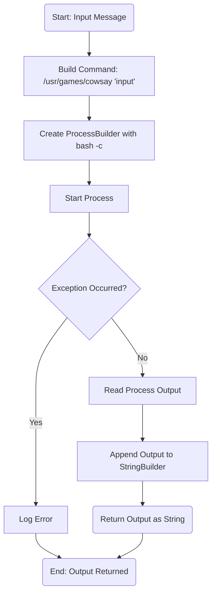
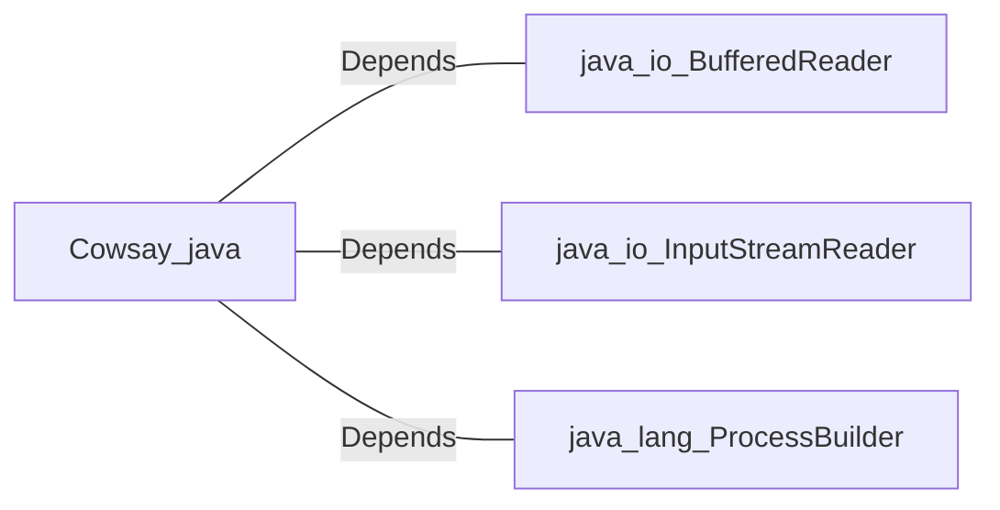

# Cowsay.java: Command Execution Wrapper for Cowsay

## Overview
The `Cowsay` class provides functionality to execute the `cowsay` command-line tool, which generates ASCII art of a cow saying a given input message. It uses Java's `ProcessBuilder` to execute the command and captures the output.

## Process Flow

## Insights
- **Command Injection Vulnerability**: The code concatenates user input directly into the command string without sanitization, making it vulnerable to command injection attacks. Malicious input could execute arbitrary commands on the system.
- **Error Handling**: The code logs exceptions using `e.printStackTrace()`, which is not ideal for production environments. A more robust logging mechanism should be used.
- **Hardcoded Command Path**: The path to the `cowsay` executable (`/usr/games/cowsay`) is hardcoded, which may cause issues if the executable is located elsewhere on the system.
- **Resource Management**: The `BufferedReader` is not closed explicitly, which could lead to resource leaks.

## Vulnerabilities
1. **Command Injection**:
   - The `input` parameter is directly concatenated into the command string without validation or escaping.
   - Example of exploitation: Passing `"; rm -rf /"` as input could execute destructive commands.

2. **Hardcoded Path**:
   - The hardcoded path to `cowsay` may not work on all systems, leading to portability issues.

3. **Improper Resource Management**:
   - The `BufferedReader` is not closed explicitly, which could lead to resource leaks.

4. **Weak Error Handling**:
   - Using `e.printStackTrace()` for error logging is not suitable for production environments and may expose sensitive information.

## Dependencies

- `java.io.BufferedReader`: Used to read the output of the executed process.
- `java.io.InputStreamReader`: Wraps the input stream of the process for reading.
- `java.lang.ProcessBuilder`: Used to create and start the process for executing the `cowsay` command.

## Recommendations
- **Input Sanitization**: Validate and sanitize the `input` parameter to prevent command injection.
- **Use Safer APIs**: Consider using APIs that allow passing arguments separately instead of concatenating them into a single command string.
- **Close Resources**: Ensure `BufferedReader` is closed explicitly using a `try-with-resources` block.
- **Dynamic Path Resolution**: Avoid hardcoding the path to the `cowsay` executable; use environment variables or configuration files.
- **Improved Logging**: Replace `e.printStackTrace()` with a proper logging framework like Log4j or SLF4J.
