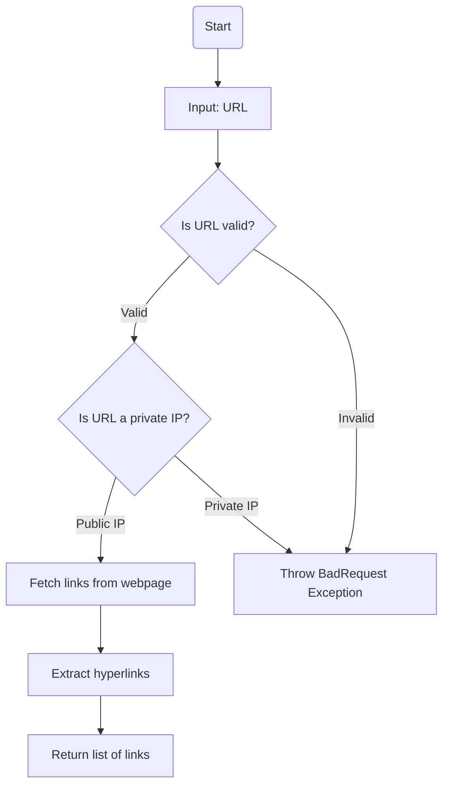
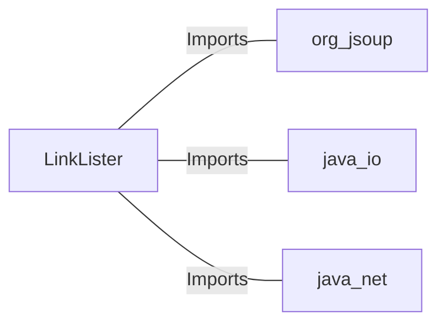

# LinkLister.java: Web Link Extractor

## Overview
The `LinkLister` class is responsible for extracting hyperlinks from a given webpage URL. It provides two methods for retrieving links:
1. `getLinks`: Extracts all hyperlinks from the provided URL.
2. `getLinksV2`: Adds validation to ensure the URL does not point to a private IP address before extracting links.

## Process Flow

## Insights
- **Private IP Validation**: The `getLinksV2` method ensures that the provided URL does not point to a private IP address (e.g., `172.*`, `192.168.*`, `10.*`). This is a security measure to prevent accessing internal resources.
- **HTML Parsing**: The class uses the `Jsoup` library to parse HTML and extract hyperlinks.
- **Error Handling**: The `getLinksV2` method throws a custom `BadRequest` exception for invalid URLs or private IPs.
- **Potential Vulnerability**: The `getLinks` method does not validate the URL, which could lead to security risks such as accessing malicious or internal resources.

## Dependencies

- `org.jsoup`: Used for HTML parsing and extracting elements from the webpage.
- `java.io`: Used for handling input/output operations, such as exceptions.
- `java.net`: Used for URL validation and manipulation.

## Vulnerabilities
1. **Lack of URL Validation in `getLinks`**:
   - The `getLinks` method does not validate the URL before connecting to it. This could allow access to malicious or internal resources, leading to potential security risks.
   - Recommendation: Add URL validation similar to `getLinksV2` to ensure safe usage.

2. **Potential SSRF (Server-Side Request Forgery)**:
   - The `getLinks` method directly connects to the provided URL without restrictions. This could be exploited to perform SSRF attacks, where an attacker forces the server to make requests to unintended destinations.
   - Recommendation: Implement stricter validation and restrictions on the URLs that can be accessed.

3. **Error Handling in `getLinksV2`**:
   - The `getLinksV2` method catches all exceptions and wraps them in a `BadRequest` exception. This could lead to loss of specific error details.
   - Recommendation: Differentiate between types of exceptions and handle them appropriately.

## Data Manipulation (SQL)
- No SQL operations are performed in this code.
