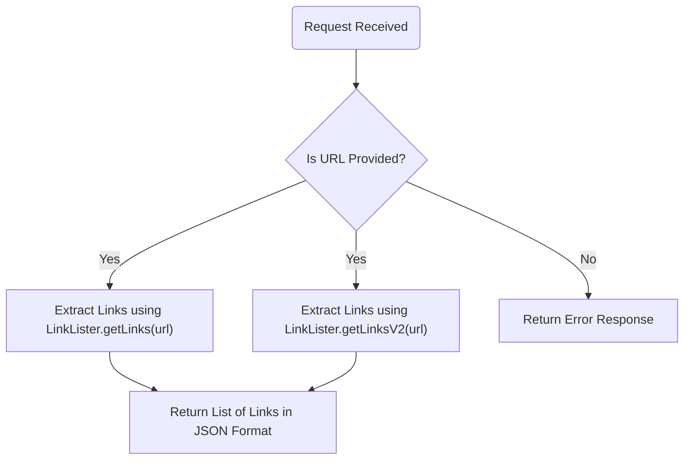
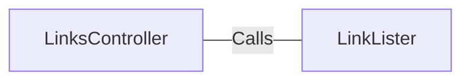

# LinksController.java: REST API for Extracting Links

## Overview
The `LinksController` class is a REST API controller designed to handle HTTP requests for extracting links from a given URL. It provides two endpoints (`/links` and `/links-v2`) that process URLs and return a list of links in JSON format. The class uses the `LinkLister` utility to perform the actual link extraction.

## Process Flow

## Insights
- The class defines two endpoints:
  - `/links`: Extracts links using the `LinkLister.getLinks(url)` method.
  - `/links-v2`: Extracts links using the `LinkLister.getLinksV2(url)` method.
- Both endpoints expect a `url` parameter to be provided via the query string.
- The `/links-v2` endpoint throws a custom `BadRequest` exception, which is likely used for handling invalid input or errors during processing.
- The `LinkLister` class is responsible for the actual link extraction logic, but its implementation is not provided in this snippet.
- The `IOException` and `BadRequest` exceptions are handled at the method level, indicating potential error scenarios during link extraction.

## Dependencies

- `LinkLister`: Provides methods `getLinks(url)` and `getLinksV2(url)` for extracting links from the given URL.

## Vulnerabilities
- **Potential Security Risks with URL Input**:
  - The `url` parameter is directly passed to the `LinkLister` methods without validation or sanitization. This could lead to security vulnerabilities such as Server-Side Request Forgery (SSRF) or injection attacks.
  - Ensure proper validation and sanitization of the `url` parameter to prevent malicious inputs.
- **Error Handling**:
  - The `/links` endpoint does not specify custom error handling for invalid URLs or processing errors, relying solely on `IOException`. This could result in unclear error responses to the client.
  - Implement robust error handling and return meaningful HTTP status codes and messages.
- **Exception Exposure**:
  - The `/links-v2` endpoint throws a `BadRequest` exception, but the implementation of this exception is not provided. Ensure that sensitive information is not exposed in error responses.
- **Lack of Authentication and Authorization**:
  - The endpoints are publicly accessible without any authentication or authorization checks. This could lead to misuse or abuse of the API.
  - Implement authentication and authorization mechanisms to secure the endpoints.

## Data Manipulation (SQL) (Optional)
No SQL-related operations or data structures are detected in this code snippet.
