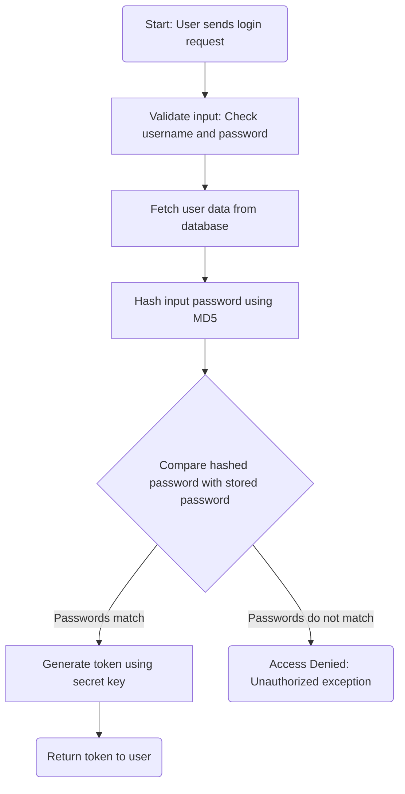
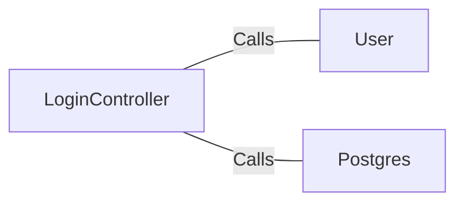

# LoginController.java: Login Authentication Controller

## Overview
The `LoginController` class is a REST API controller responsible for handling user login requests. It validates user credentials against stored data and generates a token for successful authentication. The controller uses Spring Boot annotations and integrates with external dependencies for user data fetching and password hashing.

## Process Flow

## Insights
- **Cross-Origin Resource Sharing (CORS):** The `@CrossOrigin` annotation allows requests from any origin, which may pose security risks if not properly configured.
- **Password Hashing:** The code uses MD5 for password hashing, which is considered insecure due to vulnerabilities like collision attacks. A stronger hashing algorithm (e.g., bcrypt or Argon2) should be used.
- **Hardcoded Secret Key:** The `secret` key is injected via application properties, but its security depends on proper management and storage.
- **Error Handling:** Unauthorized access is handled by throwing a custom `Unauthorized` exception with HTTP status 401.
- **Serialization:** Both `LoginRequest` and `LoginResponse` classes implement `Serializable`, ensuring compatibility for object serialization.

## Dependencies

- `User`: Fetches user data based on the provided username. It is assumed to interact with a database or external service.
- `Postgres`: Provides the `md5` method for hashing passwords. Likely interacts with a database or utility library.

## Vulnerabilities
1. **Insecure Password Hashing:**
   - MD5 is used for hashing passwords, which is outdated and vulnerable to collision attacks. Replace MD5 with a modern hashing algorithm like bcrypt or Argon2.

2. **CORS Misconfiguration:**
   - The `@CrossOrigin(origins = "*")` annotation allows requests from any origin, which can expose the application to Cross-Site Request Forgery (CSRF) attacks. Restrict origins to trusted domains.

3. **Potential Secret Key Exposure:**
   - The `secret` key is injected via application properties. Ensure it is stored securely and not exposed in version control or logs.

4. **Lack of Rate Limiting:**
   - The login endpoint does not implement rate limiting, making it susceptible to brute-force attacks.

5. **Error Message Disclosure:**
   - The `Unauthorized` exception message ("Access Denied") could provide attackers with information about failed login attempts. Consider using generic error messages.

## Data Manipulation (SQL)
- **User Data Fetching:** The `User.fetch(input.username)` method likely performs a SQL SELECT operation to retrieve user data based on the username. Ensure proper sanitization to prevent SQL injection.
