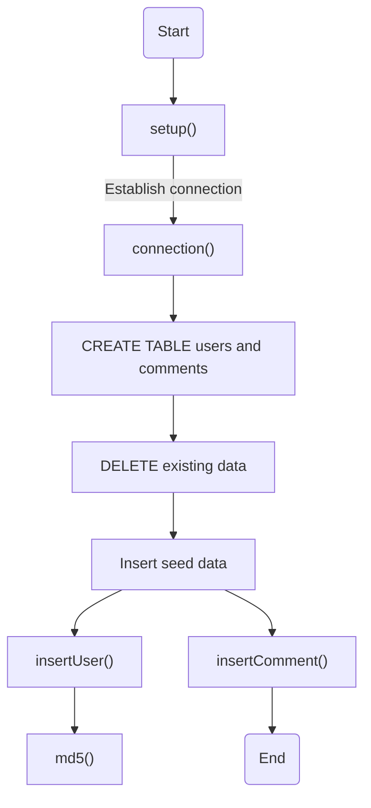
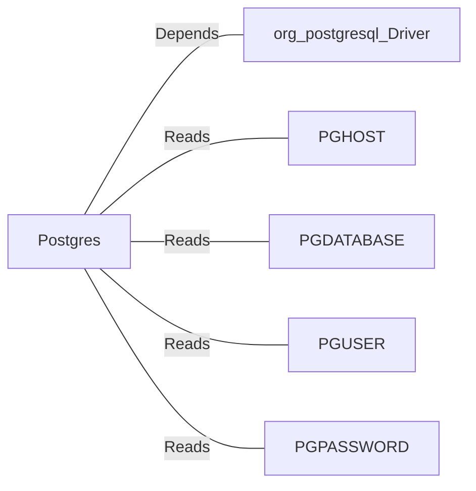

# Postgres.java: Database Setup and Interaction Utility

## Overview
The `Postgres` class is responsible for setting up and interacting with a PostgreSQL database. It provides methods to establish a database connection, create tables, insert seed data, and perform basic operations such as inserting users and comments. Additionally, it includes a utility method for generating MD5 hash values.

## Process Flow

## Insights
- **Database Connection**: The `connection()` method dynamically constructs the database connection string using environment variables (`PGHOST`, `PGDATABASE`, `PGUSER`, `PGPASSWORD`).
- **Schema Setup**: The `setup()` method creates two tables (`users` and `comments`) and ensures they exist before inserting seed data.
- **Data Cleanup**: Existing data in the `users` and `comments` tables is deleted during setup to ensure a clean slate.
- **Seed Data**: Predefined users and comments are inserted into the database for initial testing or demonstration purposes.
- **Password Hashing**: The `md5()` method hashes passwords using the MD5 algorithm before storing them in the database.
- **UUID Usage**: Unique identifiers for users and comments are generated using `UUID.randomUUID()`.

## Vulnerabilities
1. **Hardcoded Seed Data**:
   - The `setup()` method inserts hardcoded usernames and passwords, which could expose sensitive information if not properly secured.
   - Recommendation: Use environment variables or external configuration files for seed data.

2. **MD5 for Password Hashing**:
   - MD5 is considered cryptographically weak and vulnerable to collision attacks.
   - Recommendation: Use a stronger hashing algorithm like bcrypt or Argon2 for password storage.

3. **Error Handling**:
   - Exceptions are caught and printed using `e.printStackTrace()`, which may expose sensitive information in logs.
   - Recommendation: Use proper logging mechanisms and avoid printing stack traces in production.

4. **SQL Injection Risk**:
   - While `PreparedStatement` is used, the `username` and `body` fields in `insertComment()` are directly passed without validation.
   - Recommendation: Validate and sanitize user inputs to prevent SQL injection.

5. **Environment Variable Dependency**:
   - The database connection relies on environment variables, which may not be properly configured in all environments.
   - Recommendation: Add fallback mechanisms or configuration validation.

## Dependencies

- `org.postgresql.Driver`: Required for establishing a connection to the PostgreSQL database.
- `PGHOST`, `PGDATABASE`, `PGUSER`, `PGPASSWORD`: Environment variables used to configure the database connection.

## Data Manipulation (SQL)
### Table Structures
#### `users`
| Attribute   | Type          | Description                                      |
|-------------|---------------|--------------------------------------------------|
| `user_id`   | `VARCHAR(36)` | Primary key, unique identifier for the user.     |
| `username`  | `VARCHAR(50)` | Unique username for the user.                    |
| `password`  | `VARCHAR(50)` | MD5-hashed password.                             |
| `created_on`| `TIMESTAMP`   | Timestamp when the user was created.             |
| `last_login`| `TIMESTAMP`   | Timestamp of the user's last login.              |

#### `comments`
| Attribute   | Type          | Description                                      |
|-------------|---------------|--------------------------------------------------|
| `id`        | `VARCHAR(36)` | Primary key, unique identifier for the comment.  |
| `username`  | `VARCHAR(36)` | Username of the comment author.                  |
| `body`      | `VARCHAR(500)`| Content of the comment.                          |
| `created_on`| `TIMESTAMP`   | Timestamp when the comment was created.          |

### SQL Operations
- `users`: 
  - **INSERT**: Adds new users with hashed passwords and timestamps.
  - **DELETE**: Removes all existing user records during setup.
- `comments`: 
  - **INSERT**: Adds new comments with timestamps.
  - **DELETE**: Removes all existing comment records during setup.
