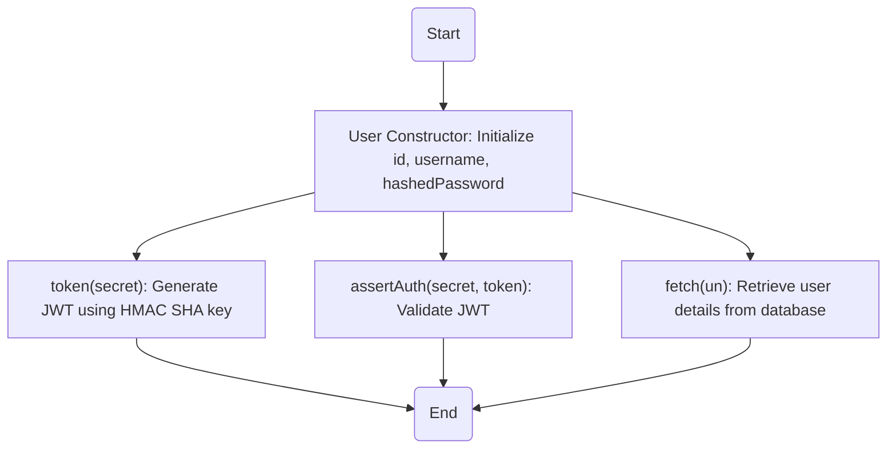
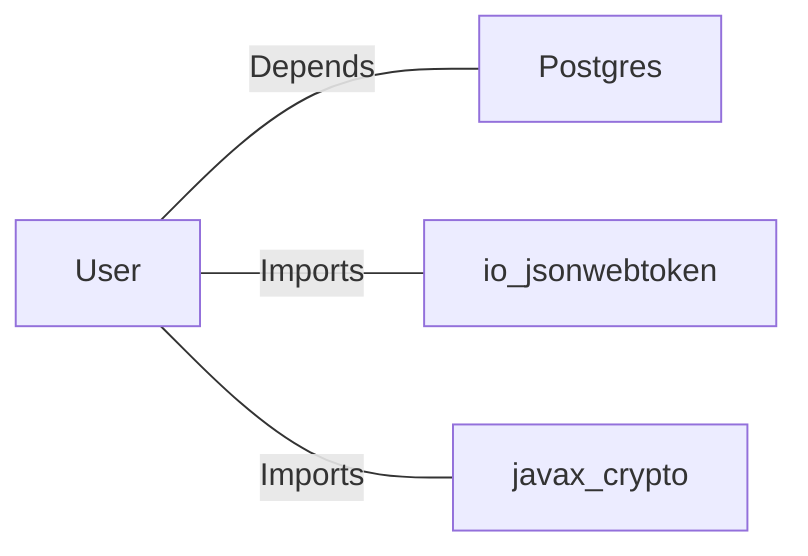

# User.java: User Management and Authentication

## Overview
The `User` class is responsible for managing user-related data and operations, including token generation, authentication, and fetching user details from a database. It provides methods for creating JSON Web Tokens (JWTs), validating tokens, and retrieving user information from a PostgreSQL database.

## Process Flow

## Insights
- **Token Generation**: The `token` method generates a JWT using the HMAC SHA algorithm and a secret key derived from the provided string.
- **Token Validation**: The `assertAuth` method validates the provided JWT using the same secret key. If validation fails, an `Unauthorized` exception is thrown.
- **Database Interaction**: The `fetch` method retrieves user details from a PostgreSQL database using a raw SQL query.
- **Potential Vulnerabilities**:
  - **SQL Injection**: The `fetch` method constructs SQL queries using string concatenation, making it vulnerable to SQL injection attacks.
  - **Hardcoded Secret Key**: The `token` and `assertAuth` methods rely on a secret key passed as a string, which could lead to security issues if the key is not securely managed.
  - **Error Handling**: The `fetch` method suppresses exceptions by printing stack traces and returning `null`, which may lead to silent failures and debugging challenges.

## Dependencies

- `Postgres`: Provides the `connection()` method to establish a connection to the PostgreSQL database.
- `io.jsonwebtoken`: Used for JWT creation and validation.
- `javax.crypto`: Used for cryptographic operations, specifically for generating HMAC SHA keys.

## Data Manipulation (SQL)
### Table: `users`
| Attribute   | Type     | Description                          |
|-------------|----------|--------------------------------------|
| `user_id`   | String   | Unique identifier for the user.      |
| `username`  | String   | Username of the user.                |
| `password`  | String   | Hashed password of the user.         |

### SQL Command
- **Query**: `SELECT * FROM users WHERE username = '<username>' LIMIT 1`
  - **Operation**: SELECT
  - **Purpose**: Fetches user details based on the provided username.

## Vulnerabilities
1. **SQL Injection**:
   - The `fetch` method constructs SQL queries using string concatenation, which is vulnerable to SQL injection attacks. Example: If `un` contains malicious SQL code, it could compromise the database.
   - **Mitigation**: Use prepared statements to safely parameterize SQL queries.

2. **Weak Secret Key Management**:
   - The `token` and `assertAuth` methods rely on a secret key passed as a string. If the key is hardcoded or poorly managed, it could lead to security breaches.
   - **Mitigation**: Store the secret key securely using environment variables or a secrets management tool.

3. **Improper Error Handling**:
   - The `fetch` method suppresses exceptions by printing stack traces and returning `null`. This could lead to silent failures and make debugging difficult.
   - **Mitigation**: Implement proper error handling and logging mechanisms.

4. **Potential Information Disclosure**:
   - The `fetch` method prints SQL queries to the console, which could expose sensitive information in logs.
   - **Mitigation**: Avoid logging sensitive data or SQL queries directly. Use sanitized logs.
